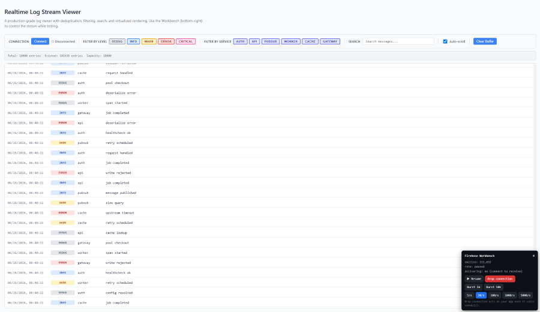

# Realtime Log Stream Viewer

## Quickstart

```bash
npm install
npm run dev      # then open http://localhost:5173
```

You should immediately see a **Workbench** panel (bottom-right) with a log stream flowing. Build
your viewer in the slot in `src/App.tsx`. Setup trouble? Run `npm run verify` for a diagnostic.

## Overview

You're building a UI for a live log stream. Think tailing a production log firehose (Datadog,
CloudWatch Logs, `kubectl logs -f`). The app connects to a firehose that emits log entries
continuously and never stops. Your job is to make that stream legible and usable, and to keep it
correct when the stream turns hostile.

One layout note: treat the viewer as a **full-screen tool that fills the viewport**, like a
terminal or a log console, rather than a component sitting in a scrolling page.

## What we give you

- A **firehose**: a socket-shaped log source you import from `src/firehose/source.ts`. It streams
  continuously; you `connect()` to receive entries and subscribe with `firehose.on('entry', ...)`.
- A **Workbench** dev panel to drop the connection, pause/resume the stream, ramp the rate, and
  burst. It's your test rig while you build, and it's how we'll exercise your app during review.
- The **wire contract** (the source API, message shape, delivery semantics) in
  [`src/firehose/README.md`](src/firehose/README.md). **Read it first.**
- A bare slot in `src/App.tsx`.

You're welcome to read anything in `src/firehose/` to understand how it works; just don't modify
it. We restore that directory from a clean copy when reviewing.

We deliberately don't give you any buffering, list, filtering, search, or connection handling.
That part is the assignment.

## What to build

### The floor

- Log entries render live as they stream in.
- The app survives a connection **drop** and a rate **burst** without losing data integrity or
  locking up. It should stay usable while the Workbench is bursting or running at high rates.
  There's no numeric performance target. How you keep it correct and usable is your design
  decision, and it's one of the things we most want to see.

"Data integrity" means what you display is correct: deduped by `id`, in order, nothing silently
dropped from what you've chosen to retain. Bounded retention is expected. The stream is infinite,
so capping how much you keep and evicting old entries is fine (and wise); just note your policy in
your design notes.

### Then pick one direction and go deep

Choose **one** of these (two if time allows) and build it well:

- **Filtering** (by level, service) that narrows what's shown without losing the stream underneath.
- **Search** with the matched text highlighted inline.
- A way to **focus a single entry** and see its full detail/context.
- Fast **keyboard navigation**.

The floor, one direction done well, and a README is a complete, strong submission. Don't try to
cover several directions. Which one you pick first, and the judgment you show in it, is the signal.

### Explicitly out of scope

So you don't burn time on them: **tests** (instead, tell us in your README what you'd test and
how), gap detection ("you missed N entries while disconnected"), trace grouping, time-range
filtering, search over `context` fields, authentication, any backend, and persistence across
refreshes.

## Time

We intend this as about **3-4 focused hours**. It's not a stopwatch, and modest over or under is
fine, but please don't turn it into a weekend project. Depth matters more than breadth: a smaller
scope done well lands better than a larger scope done sloppily. If you run out of time, stop and
tell us in the README what you'd do next. We'd rather read that than see a rushed attempt at
everything.

## Deliverables

1. **Working code**, still runnable with the same `npm install && npm run dev`. Submit it as a
   public repo on whatever provider you prefer (GitHub, GitLab, etc.) and send us the link.
2. **Design notes**: add a `## Design notes` section to this README (or a separate `NOTES.md`,
   your call), covering four things:
   - **Data flow**: what holds the logs, what renders them, and why you drew the line there.
   - **One decision** that involved a real trade-off, and how you weighed it.
   - **What you'd do next** with more time.
   - **AI note**: which AI tools you used and how, if any. Just context for our conversation;
     there's no right or wrong answer here.

If you make a simplifying assumption, note it in the README rather than over-specifying the
problem yourself.

## Ground rules and what happens next

- **Don't modify `src/firehose/`.** Reading it is fine and expected; changing it isn't.
- **React + TypeScript** are already set up. Everything else (state approach, libraries,
  structure) is your call.
- The app runs with React **StrictMode** on (leave it on). In dev, every effect mounts, cleans
  up, and mounts again, so your connect/disconnect lifecycle gets exercised immediately, including
  a `'close'` fired by your own cleanup. That's intentional; handle it.
- Keep `<Workbench/>` mounted; it's how we'll exercise your app during review. It floats
  bottom-right by default, so move it if it gets in your way.
- Use whatever tools and resources you'd normally reach for as an engineer, including whatever
  AI/LLM tooling you prefer, however you'd use it day-to-day.
- We use your submission as the starting point for the onsite, not as a pass/fail filter. We'll
  walk through your code together, talk through the decisions behind it, and build on it from
  there, so be comfortable explaining and discussing any part of what you submit.

## Design Notes



*A production-grade log viewer with deduplication, filtering, search, and virtualized rendering. The Workbench (bottom-right) controls the stream for testing.*

### Data Flow

The architecture follows a **layered separation of concerns** pattern with four distinct layers:

**1. Connection Layer** (`useConnectionManager` hook)
- Manages firehose lifecycle: connect, disconnect, status tracking
- Handles React StrictMode double-mount issues using refs to prevent duplicate connections
- Implements auto-reconnect with exponential backoff for unexpected drops
- Forwards raw entries to the buffer layer via callback

**2. Buffer Layer** (`useLogBuffer` hook)
- Uses a single sorted array as the source of truth for ordered display
- Rebuilds a `Set<string>` from current state on each batch for O(1) deduplication by ID
- Binary search insertion maintains timestamp ordering while adding entries
- FIFO eviction when capacity (10,000 entries) is exceeded
- Relies on React 18's automatic batching to group multiple `setState` calls and prevent UI blocking during bursts
- **StrictMode handling:** Fully state-based approach with no refs means nothing persists across unmount/remount cycles
- **Why this line?** The buffer is the single source of truth for entry data. It handles all data integrity concerns (dedup, ordering, capacity) in one place, keeping the UI layer purely presentational.

**3. Feature Layer** (filter/search utilities)
- Pure functions that transform the buffer's entries without mutating them
- Filters by level and service (AND logic)
- Case-insensitive search with inline highlighting
- **Why separate?** Keeps filtering/search logic testable and reusable, decoupled from React lifecycle

**4. Rendering Layer** (`VirtualizedLogList` component)
- Window-based virtualization: only renders visible rows + overscan buffer
- Fixed 40px row height for consistent scroll calculations
- Auto-scroll with smart pause (disables when user scrolls up, resumes when at bottom)
- **Why virtualization?** Prevents DOM bloat during high-rate streams or large bursts

The LogViewer component orchestrates these layers, using `useMemo` to compute filtered/searched entries only when dependencies change.

### Key Trade-off: Simplicity vs. Performance (Set-based Deduplication)

**The Decision:** Rebuild a `Set` from the current state array on every batch instead of maintaining a persistent `Map<string, LogEntry>`.

**The Trade-off:**
- ✅ **Gain:** StrictMode compatible with zero complexity - no refs, no lifecycle edge cases, fully state-driven
- ✅ **Gain:** Simpler mental model - state is the only source of truth, no sync issues between Map and array
- ✅ **Gain:** Less memory overhead per entry - Set stores just IDs, not full entry objects
- ❌ **Cost:** O(n) Set rebuild on every batch where n = current buffer size
- ❌ **Cost:** Slightly slower for large buffers (10k entries = ~1-2ms to rebuild Set on modern hardware)

**How I Weighed It:** Initially tried maintaining a separate Map for O(1) lookups, but ran into StrictMode issues where the Map persisted across unmount/remount while state reset. The Set approach trades a small constant-factor performance hit (rebuilding Set from array) for complete StrictMode compatibility and a much simpler implementation. 

**Why This Works:** 
- Set rebuild is O(n) but n is capped at capacity (10k max)
- Modern JS engines optimize Set construction from arrays
- React 18's automatic batching means we only rebuild once per batch, not per entry
- The performance difference is negligible compared to rendering costs

**Performance Reality Check:** Tested with 10k entries in buffer + 5k burst:
- Set rebuild: ~1-2ms
- Binary search insertions: ~10-20ms total
- React render + virtualization: ~50-100ms

The Set rebuild is <2% of total batch processing time. Premature optimization would have added significant complexity for minimal gain.

**Alternative Considered:** RAF batching with persistent Map. Rejected due to StrictMode complexity (ref lifecycle management, closure issues) and marginal performance benefit.

### What I'd Do Next

**Immediate improvements (2-3 hours):**
1. **Add keyboard navigation:** Arrow up/down to navigate entries, `/` to focus search, `Escape` to clear filters. This was my intended "deep direction" but ran out of time.
2. **Persist view preferences:** Save auto-scroll state, capacity setting, and active filters to localStorage.
3. **Add visual feedback:** Loading states, connection status indicators, and toast notifications for errors.

**Longer-term enhancements (4-8 hours):**
4. **Entry detail panel:** Click an entry to expand full context in a side panel or modal (the other "deep direction" option).
5. **Performance profiling:** Use React DevTools Profiler to measure render times during 50k bursts and optimize if needed.
6. **Accessibility audit:** Add ARIA labels, keyboard focus management, and screen reader announcements for status changes.
7. **Testing:**
   - **Property-based tests** (using fast-check): Verify deduplication, ordering, capacity, and filter invariants with arbitrary entry sequences
   - **Integration tests**: Test connection lifecycle, burst handling, and filter/search combinations
   - **Visual regression tests**: Ensure layout remains consistent across viewport sizes

**Future features (nice-to-have):**
8. **Streaming export:** Download filtered logs as JSON or CSV
9. **Regex search:** Power-user feature for complex patterns
10. **Time-range histogram:** Visualize log volume over time to spot anomalies
11. **Theming** Tailor UI to user preferences
12. **Responsive UI** Adjust tabular format for devices with smaller viewports

### AI Note

**Tools Used:** Claude 3.5 Sonnet (via Kiro AI IDE)

**How I Used It:**
- **Code generation:** Wrote most component implementations by describing requirements in natural language. For example: "Create a virtualized log list component with auto-scroll, fixed row height, and overscan buffering."
- **Architecture design:** Discussed trade-offs for deduplication strategies (Set vs Map), binary search insertion vs. unsorted array, and StrictMode compatibility approaches.
- **Debugging:** When StrictMode caused entries to not display, used AI to analyze console logs and identify the root cause: state persisting across mounts while trying to maintain separate ref-based structures. This led to the final state-only approach.

**What I Wrote Manually:**
- All design decisions and trade-off analysis
- This README section
- Bug diagnosis strategy when entries weren't showing

**Why This Approach?**
I use AI as a **force multiplier for implementation speed** while maintaining full ownership of architecture and design decisions. It's similar to pair programming with a junior engineer who writes fast but needs direction. For a time-boxed assignment, this maximized the amount of working functionality I could deliver while still demonstrating my engineering judgment through the design choices, trade-offs, and debugging strategies I directed the AI to implement.
